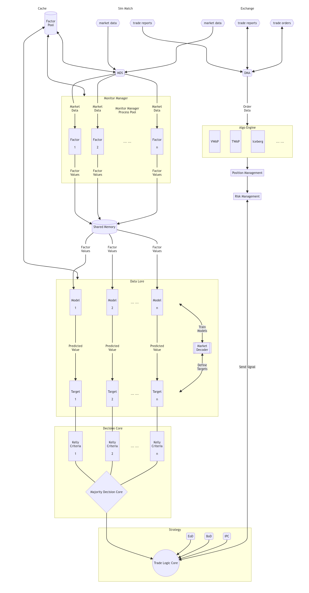

Quark is a python HFT trading / testing platform.

Quark is designed as a factor driven trading platform, which
- Can design, build, test, validate fit and ensemble the factors.
- Generates trade signal with the factor values.
- Handles market data and orders, providing position management.
- Ensures logic / code consistency between live-production and backtesting.
- Can be applied to trading stocks, stock indices, derivatives, etc.

---

# Structure


## Data Processing

Quark collect lv2 data stream.
- The market data is fed into a MarketDataService (`MDS`).
- Multiple FactorMonitor are registered at `MDS`, each representing a factor.
- Utilizing multiprocessing and shared memory to achieve low latency and high performance.
- Market data processing follows a NO-COPY, No-ALTERATION principle.

## Factor Generation

for each MarketDataMonitor, the strategy collect its signal (factor values) on a given interval.
- Use .value property of the monitor to collect generated factor.
- the factor value must be a float, or a dict of float.
- A MonitorManager is provided to collect signal from other processes.
- Collected factor values are logged by a metric module, for decision-making and other future usage such as training, reviewing.

## Fitting

With the collected factor values, the Calibration module provides several fitting algos for different prediction targets.

By default, a general linear module with bootstrap is provided.

7 prediction targets are also provided, see [prediction target]().

## Trade Decision

Based on the collected signal and current position / balance, the decision core is to make a trade decision (signal).

By default, the strategy is using a dummy core, so that no trade action can be triggered without proper initialization.

In production mode, the dummy core can be Override by a real decision core, like a MajorityDecisionCore.

---

# Usage

## Installation

clone this model with 

```shell
git clone https://github.com/BolunHan/Quark.git
```

setup a python venv

```shell
python3 -m venv venv_quark
. venv_quark/bin/activate
```

install requirements, these packages are required for production
```shell
python -m pip install -U pip setuptools wheel
pip install -r requirements.txt
```

Optional: install optional requirements, these package are required for backtesting 
```shell
pip install plotly pytz baostock, py7zr scikit-learn xgboost forestci statsmodels
```

## Run

### For Production

```shell
env QUARK_CWD="Quark/runtime" python "Quark/__main__.py"
```

- the `$QUARK_CWD` is to set a runtime dir for quark program
- the __main__.py is the entry point of the production

### For Backtesting

```shell
env QUARK_CWD="Quark/runtime" python "Quark/Backtest/__main__.py"
```

### For Factor Training and Validation

```shell
bash validation.sh
```

Note that this might take a lot more ram than production and backtest.

## Development

A variance of factor template is provided at `Quark/Factor/utils.py` and `Quark/Factor/utils_shm.py`.

To use these template, inheritance is advised. See the demo at `Quark/Factor/TradeFlow/trade_flow.py` for more details.

To add a new factor:
- Add your code at `Quark/Factor/<your factor dir>/<your factor scrtip>.py`.
- Import your script at `Quark/Factor/__init__.py`
- If the factor value need custom collection function, amend the function `collect_factor()` at `Quark/Factor/__init__.py`.
- Update validation script to train and test your factor. Add your factor at `initialize_factor` function, and the feature name at `self.features` list.
- For production and backtest, also update decision core in `Quark/DataLore/data_lore.py`. Add the feature name to `self.input_vars`.
- Also, if the factor does not follow the naming convention, update the `Quark/Factor/factor_pool.py` for proper caching.

To implement new data lore
- add new module in `Quark/DataLore`

To implement new decision core
- add new module in `Quark/DecisionCore`

To further implement new trading behavior and trading algorithm,
- clone the [PyAlgoEngine](https://github.com/BolunHan/PyAlgoEngine.git)
- add new algo in `AlgoEngine/Engine/AlgoEngine.py`
- add or amend execution logic at `AlgoEngine/Engine/TradeEngine.py`

To init / amend backtest
- edit `Quark/Backtest/__main__.py`
- run the script, with cwd as `/home/bolun/Projects/Quark/`, to resolve the relative import.
- to amend sim-match logic, edit `SimMatch` in PyAlgoEngine `AlgoEngine/Engine/TradeEngine.py`

Debug and Profiling

A telemetry module `Quark/Base/_trelemetric.py` offer a profiling module `PROFILER`.
- enable the profiler by setting parameter `enable=true`
- hook the profiler to a method by adding the decorator `@PROFILER.profile` to the method
- hook the profiler to a class by adding the decorator `@PROFILER.profile_all` to the class
- the profiler will provide a report and dump it to cwd.
- Disable the profiler in production mode to avoid latency issues.

API

Implement new trade, market, historical api at `Quark/API` module.

---

# Known Issues and Roadmap

- [ ] C++ version EventEngine has some performance issue.
- [ ] Shared memory feature having performance issue (but still better than singleton). Resource tracker giving false alarm (a [python issue](https://bugs.python.org/issue39959)).
- [ ] IPC partially implemented.
- [ ] Timezone awareness of datetime object is not tested.